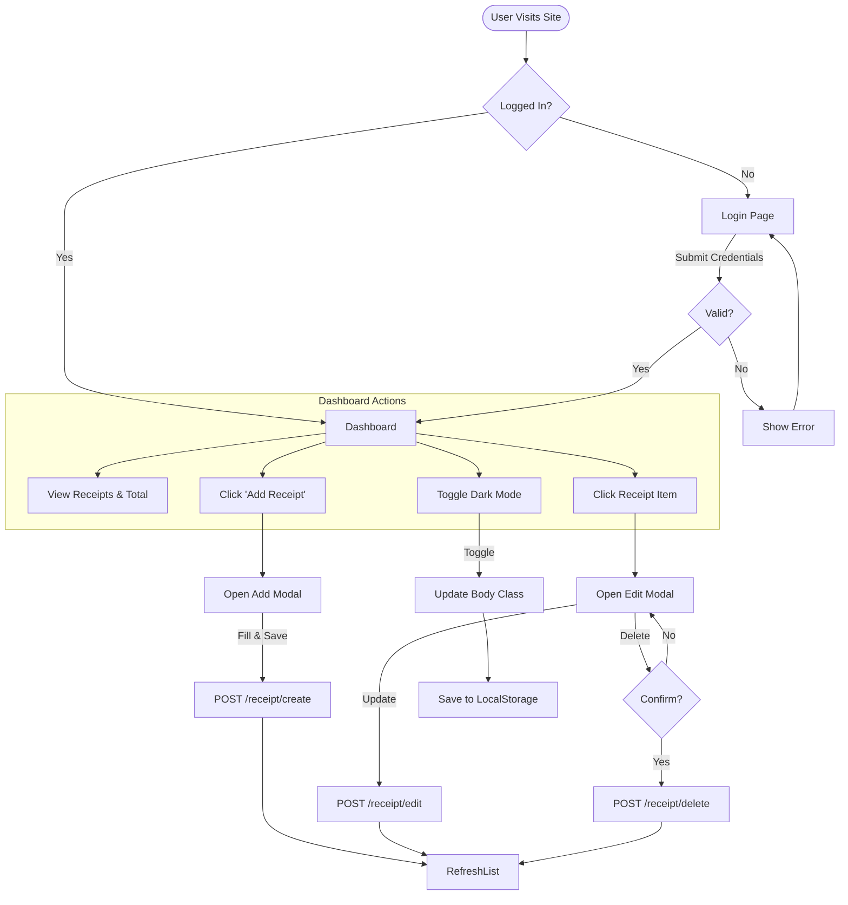

# System Flowchart

User journey and high-level logic flow.

```mermaid
flowchart TD
    Start([User Visits Site]) --> CheckAuth{Logged In?}
    
    CheckAuth -- No --> LoginView[Login Page]
    CheckAuth -- Yes --> Dashboard[Dashboard]

    LoginView -->|Submit Credentials| APIAuth{Valid?}
    APIAuth -- No --> ShowError[Show Error] --> LoginView
    APIAuth -- Yes --> Dashboard

    subgraph "Dashboard Actions"
        Dashboard --> ViewList[View Receipts & Total]
        Dashboard --> AddBtn[Click 'Add Receipt']
        Dashboard --> EditBtn[Click Receipt Item]
        Dashboard --> ThemeBtn[Toggle Dark Mode]
    end

    AddBtn --> AddModal[Open Add Modal]
    AddModal -->|Fill & Save| SaveReceipt[POST /receipt/create] --> RefreshList

    EditBtn --> EditModal[Open Edit Modal]
    EditModal -->|Update| UpdateReceipt[POST /receipt/edit] --> RefreshList
    EditModal -->|Delete| DelConfirm{Confirm?}
    DelConfirm -- Yes --> DeleteReceipt[POST /receipt/delete] --> RefreshList
    DelConfirm -- No --> EditModal

    ThemeBtn -->|Toggle| UpdateCSS[Update Body Class] --> SavePref[Save to LocalStorage]
```
